# Deployment

### Screencast 

Deploy : https://youtu.be/QSpcJWYnb5A

### User Acceptance Tests

##### Test Requirements

To run this tests, we have created 2 Slack users and their credentials are as follows.

``` email: guest1.whatbot@gmail.com password: 12345ABCDE ```

The user needs to login to our slack team by visiting the [Slack page](https://parkwoodgang.slack.com/)  
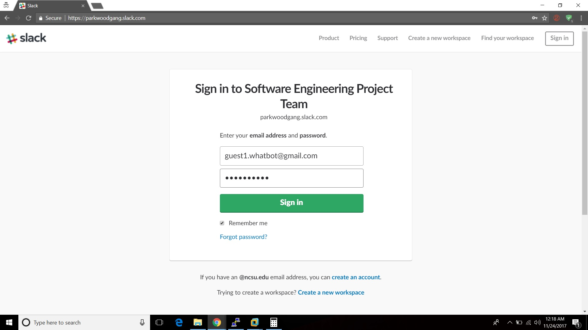

##### Pre UseCase Steps:

* Login to [authenticate](http://54.156.253.240:4500/login) here to get the standup configured.  

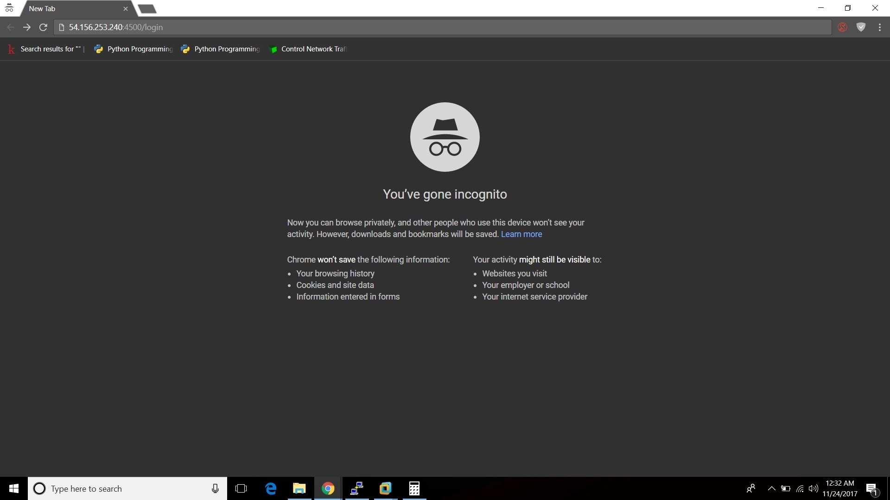  
  
* Enter **parkwoodgang**  as the team name and select **continue**  

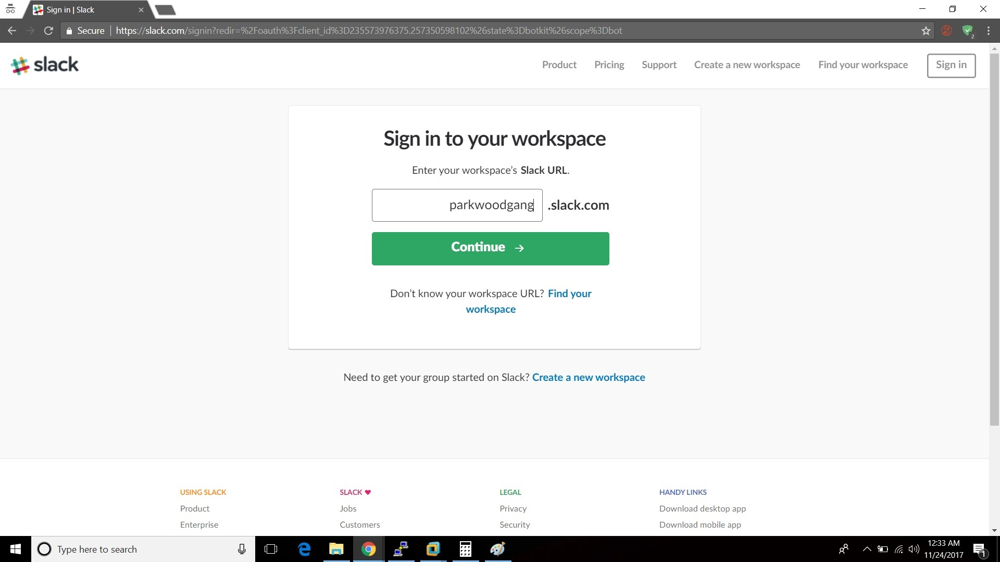  
  
* You then need to signin using one of the credentials provided above  
  
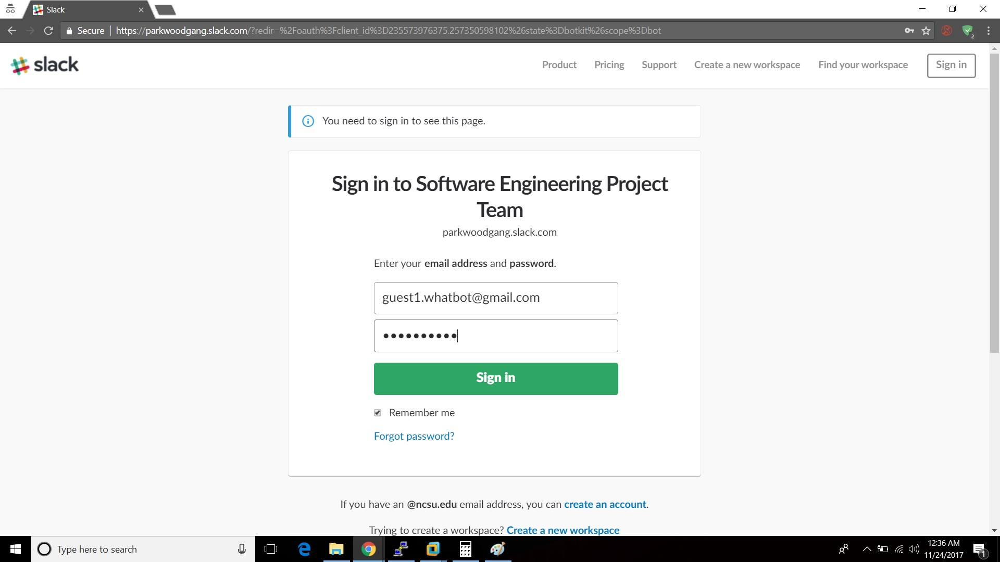  
  
* You then need to click on **Authorize**  
  
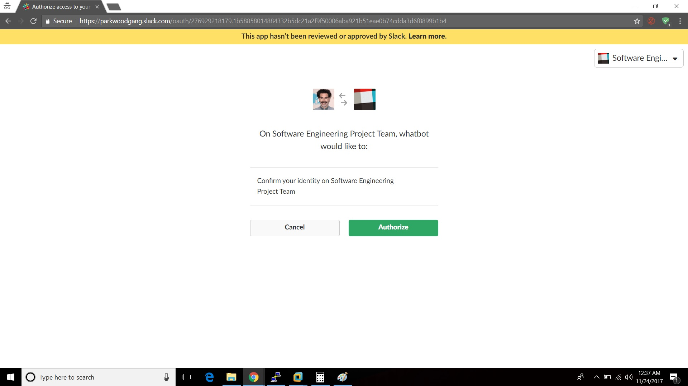  
  
* You will then get the success screen  
  
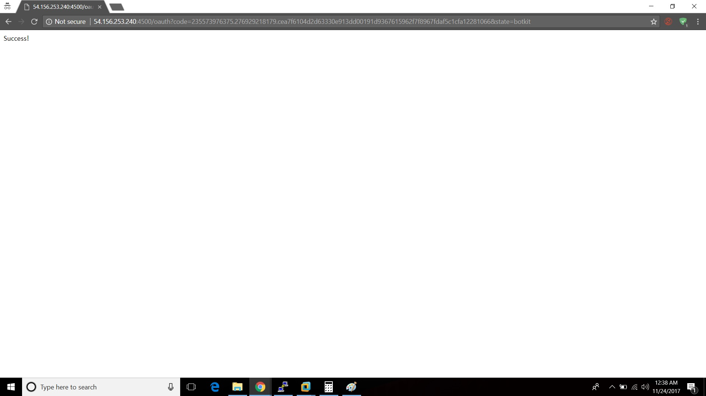  
  
##### Use Case 1:
* Login to the slack team [website](https://parkwoodgang.slack.com/).  
  
  
  
* You will see a new message from Whatbot
    
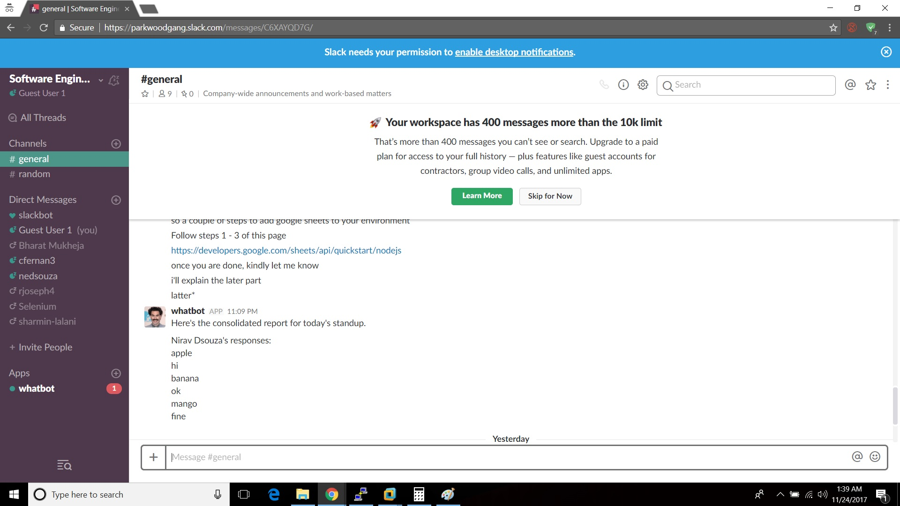
  
* You can go ahear and begin the setup  
  
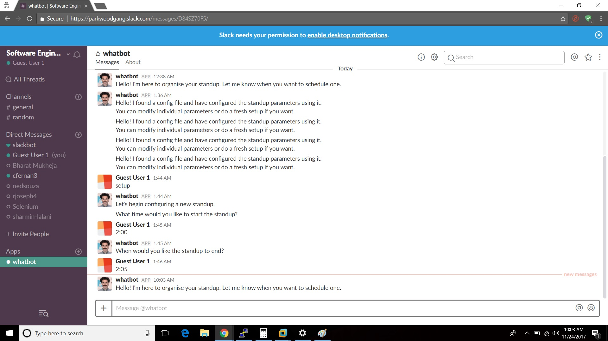  
  
* Select the time you want the standup to begin
  
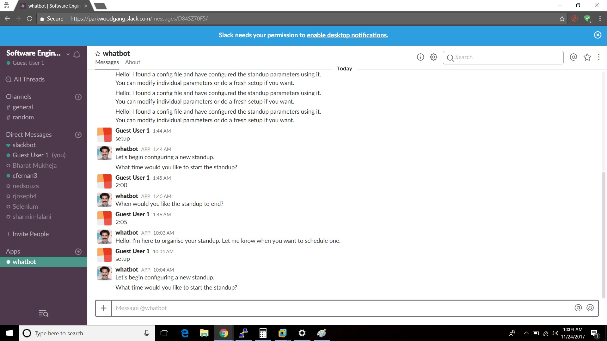
  
* Select the time you want the standup to end
  
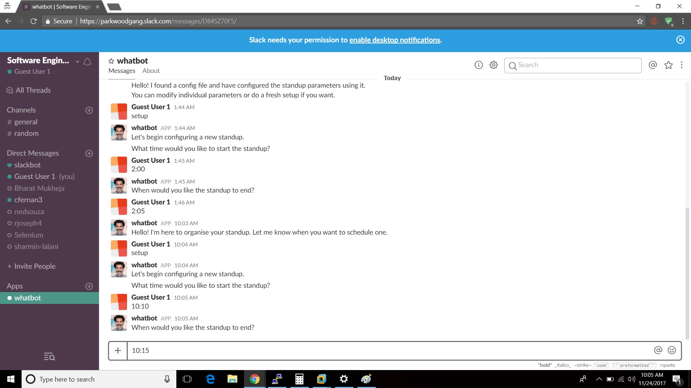

* Select the users you want to participate in the standup
    
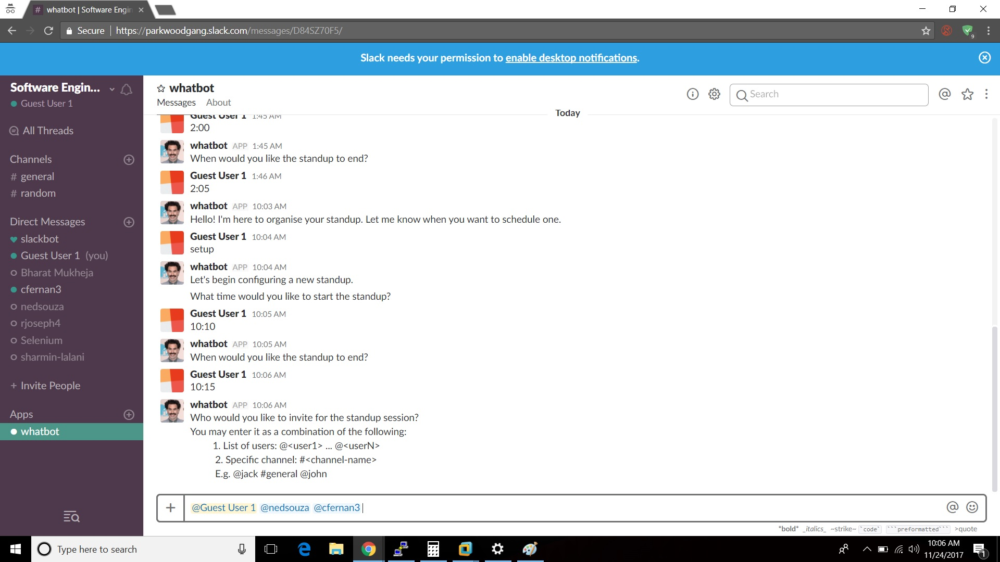

* Select the questions. You can cheeose the default question set or make your own.

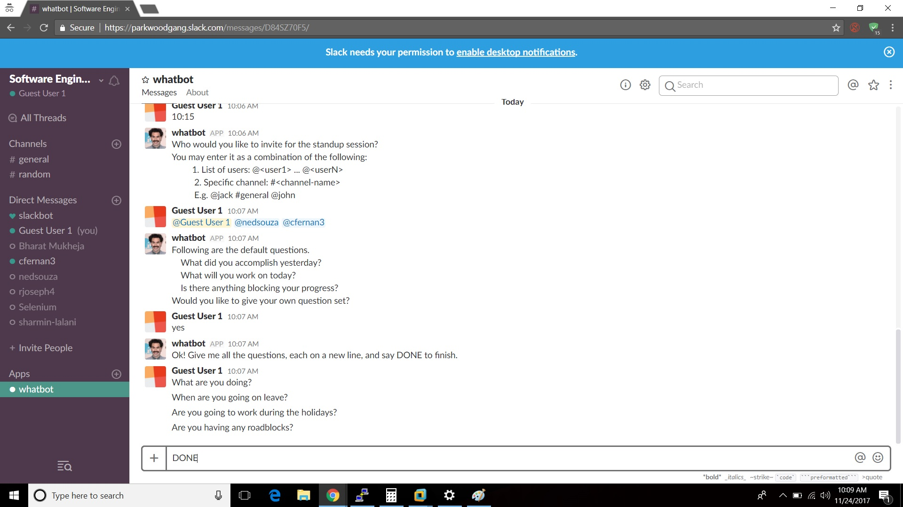
  
* Select the reporting method
  
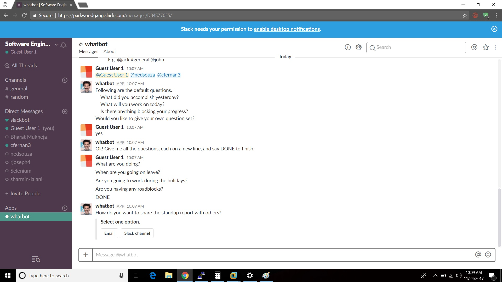


